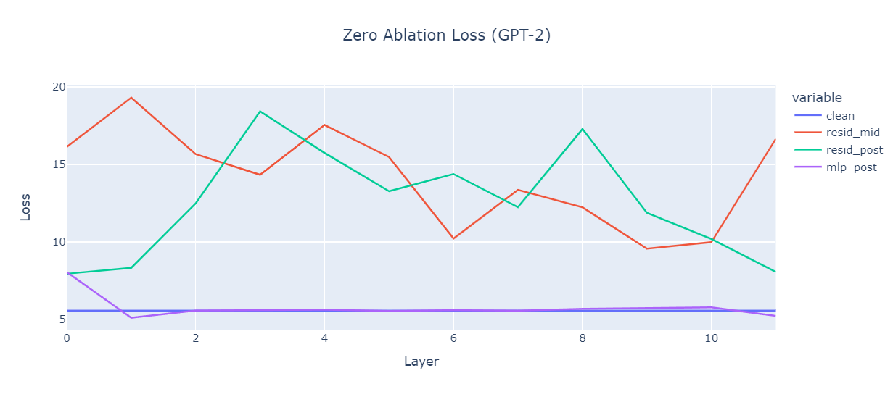

# Stop using "Loss Recovered"

## Problem statement

I've recently started getting into SAEs. This technique has been hyped up significantly and for good reason. However, the techniques to evaluate their "quality" have remained a bit vague. Two metrics are commonly used.

- **reconstruction loss**: this is a local metric which is usually the L2 norm of the reconstruction and the original activations.
- **loss recovered**: this is a global metric that aims to quantify how strong the patching in the SAE "disturbs" the whole model.

In this short post, I would like to talk about the latter and why it shouldn't be used (especially in the residual stream). In software terms, this metric is a "leaky abstraction", the notion it aims to convey depends on too many factors that it generally ceases to be useful. To understand why, let's briefly talk about the exact computation behind this metric and why it is used.

$$ \text{loss recovered} = \dfrac{L_{patched}(X) - L_{clean}(X)}{L_{corrupt}(X) - L_{clean}(X)} $$

This formula aims to determine how much patching in the SAE alters the loss compared to a fully corrupt baseline. Let's break this down:

- $L_{clean}(X)$ simply signifies the loss of a perfectly normal run on inputs $X$.
- $L_{patched}(X)$ corresponds to replacing a certain activation with the reconstructed version from an SAE. Mathematically: $L(X | do(act = \text{decode}(\text{encode}(act))))$ .
- $L_{corrupt}(X)$ represents a fully corrupted "baseline", usually done by zero ablating the activations in question. Mathematically: $L(X | do(act = 0))$

> (the $do$ operation sets the activation $act$ to the lhs)

If we assume that fully ablating an activation is the worst-case operation (it often is), then this quantifies how good the reconstruction of an SAE is on a scale between 0 and 1 (0 = no difference, 1 = fully destroys the component). The issue of this approach is that zero ablating can have variance across activations/models. Put differently, zero ablating can sometimes fully wreck the model and sometimes the model can recover to a certain degree. This means that the "loss recovered" is sensitive to this scale.

When comparing different SAEs on the exact same model and point/layer, this poses no problem as the scale is constant. However, if this metric is used across layers, it quickly becomes meaningless. While the authors of articles may have the best intentions and perform correct evaluations and comparisons, many readers will inevitably draw faulty conclusions.

## Evidence

To quantify how big an issue this could be, I zero ablated several parts of GPT-2 and recorded the loss.

> Other models, although not shown, exhibit similar patterns (pythia seems to be quite consistent though, maybe thanks to parallel attention).

The first observation is that zero ablating the residual stream exhibits extremely unpredictable behaviour. The differences between the baseline and the corrupt version varies between 3 to 15. Let's focus on layer 1, this means that if an SAE, trained on resid_post, both get a loss recovered of 90%, an SAE of same "quality", trained on resid_mid, suddenly skyrockets to 98%, not because it is better but because for some arcane reason, the zero-ablation on resid_mid sends the model way off-distribution.

Another observation is that ablating a simple MLP layer generally has no extreme effect on average. This means that the loss recovered metric is fine for that setup. Although, loss 'recovered' in a component that inherently seems to hurt loss (such as mlp 11 for instance) is a bit strange.

This can be evidently seen from many posts/papers that use this metric, the loss recovered varies strongly between layers, not because the layer is harder to reconstruct but because the scale is just scuffed. Furthermore, this metric depends on a plethora of variables. For instance, dropout models will probably deal with this zero ablation better (due to potential future lens behaviour), which would result in lower % loss recovered. An unfortunate consequence is that the conclusion that SAEs work worse on dropout models.

## Solution

Actually solving this issue is slightly involved; different parts of the model behave differently and have different importance to the model. Therefore, taking the difference between $L_{clean}$ and $L_{patched}$ is inherently flawed. However, it's probably the best and simplest option I currently see. This leaves us with "just use a more sensible value for $L_{corrupt}$". There are different options that don't require the model to go off distribution. This mostly boils down to comparing to random guesses of the model with varying degrees of accuracy (fully uniform, including unigram distributions, etc...). However, none of these seem appealing.

Personally, I would recommend throwing away the "loss recovered" and simply using "loss added" (shown below). This is no longer a clean scale between 0 and 1 but doesn't rely on an arbitrary value.

$$ \text{loss added} = \dfrac{L_{patched}(X) - L_{clean}(X)}{L_{clean}(X)} $$
